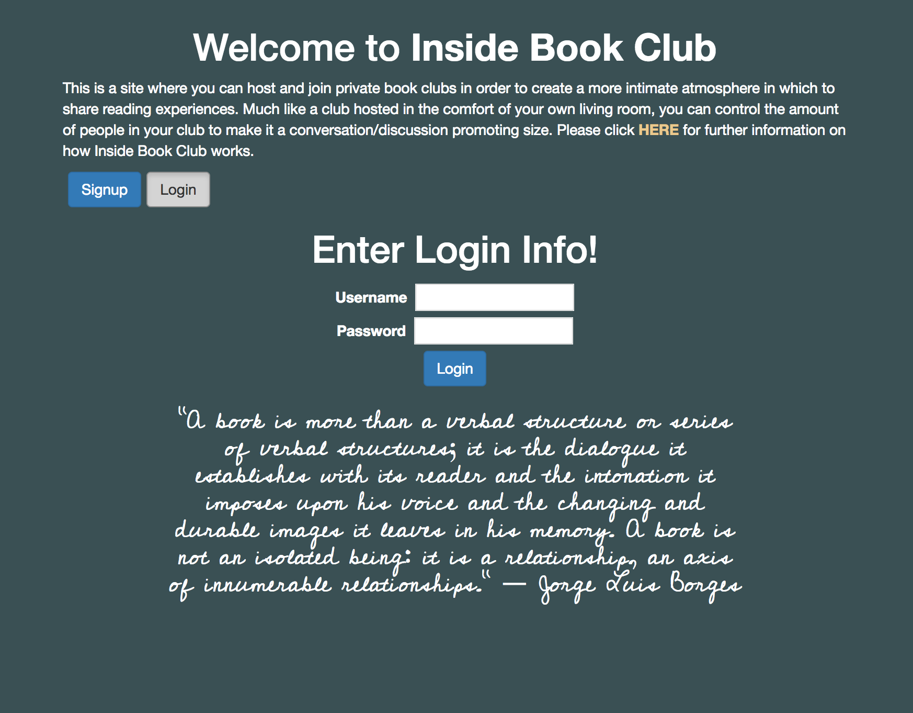
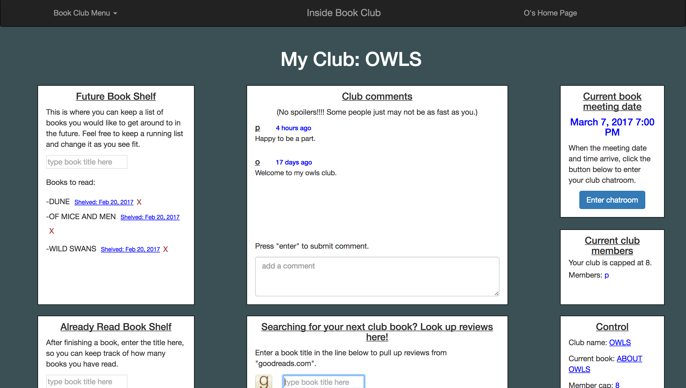
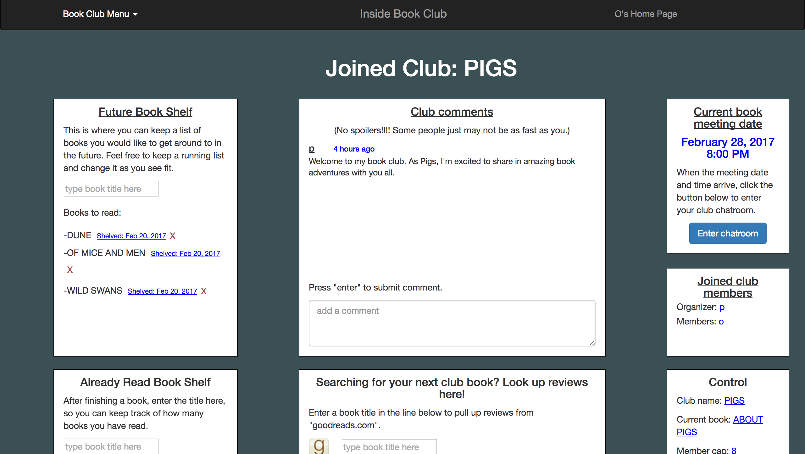
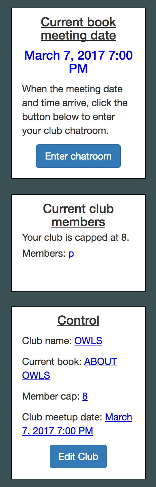
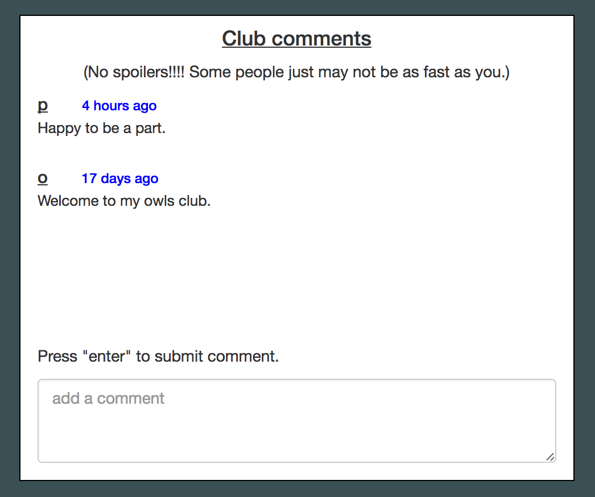
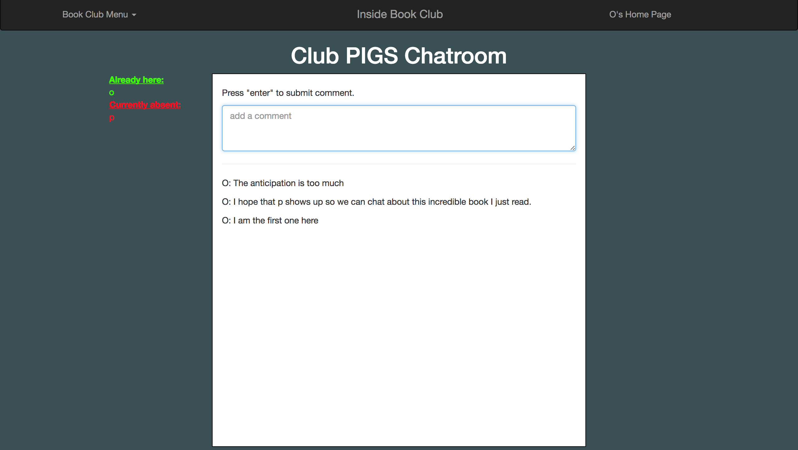
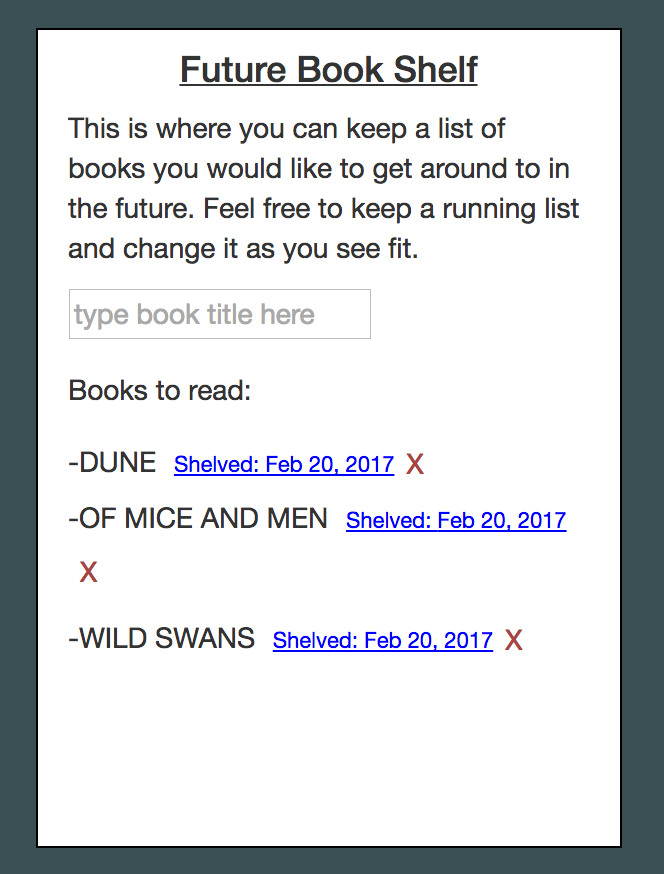
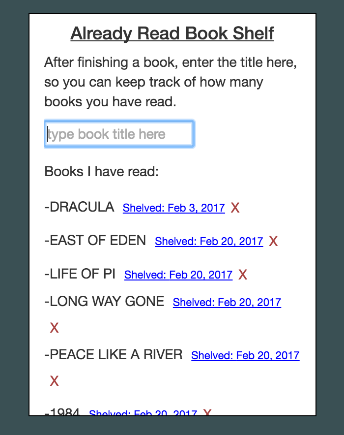
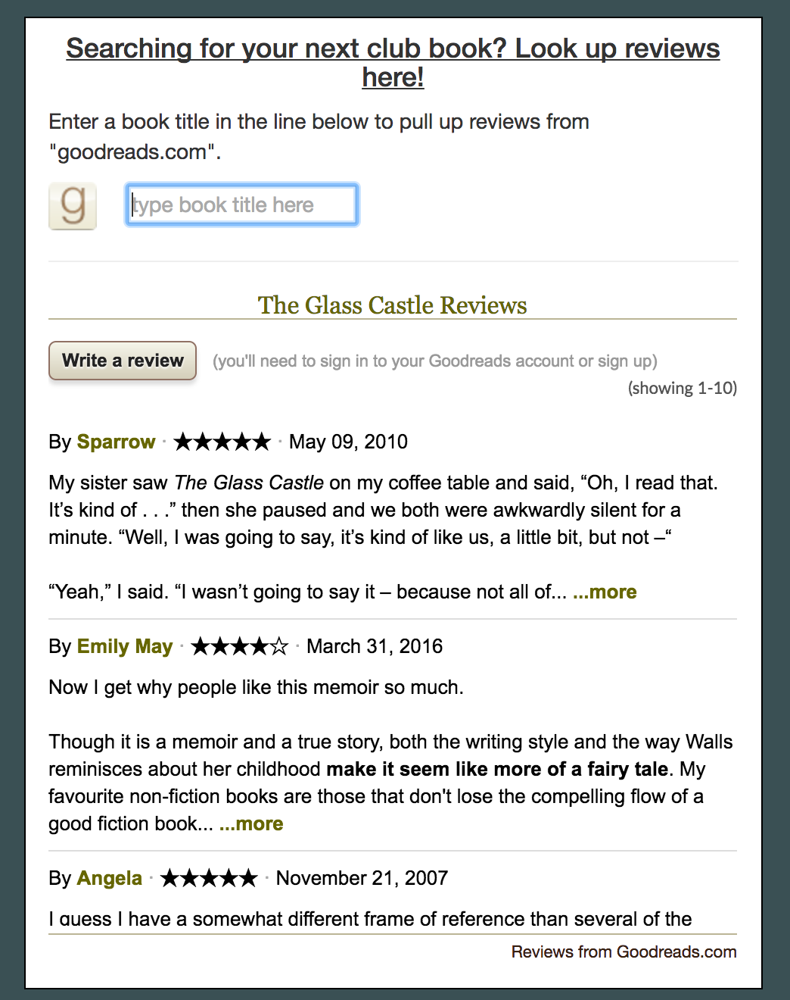

Inside Book Club
==========
This is a full MERN stack app built using react, redux, node.js, express, mongodb, and many other frameworks that will be listed below.  This was for a capstone project to complete the thinkful.com development bootcamp. The app's purpose is to provide a private book club setting where you can share your reading experiences in a more intimate setting designed to mirror a book club you would find in your own home.  

Summary
-------
With Inside Book Club, a user may create an account and have access to a total of 2 clubs.  On that the user organizes, and one that the user may join.  Once a club is created, you have a number of features that allowsy you to keep up with your club's details and members.  You also have a chatroom available for club meetings after a book deadline has been met by the group.  The app also allows you to keep track of books you've read and would like to read, and gives you the option to pull up book reviews from https://www.goodreads.com/ api.    

Live Site
---------
Inside Book Club can be accessed at https://mighty-wave-93354.herokuapp.com/

Features
--------
|  |  |  |
|:---:|:---:|:---:|
| Login Page | My Club | Joined Club |

The landing page pulls up a sign in, login, or an information page.  Once logged in, you can either visit your created club, or your joined club.  Both of which have many features used to pass information and handle that particular club.  

|  |  |  |
|:---:|:---:|:---:|
| Club Control | Comments | Chatroom |

These are three features that both club pages contain.  Club Control has options to view the meetup date, club members, club details, and also gives you the option to edit the club if it's yours, or leave the club if it's joined. The comment section allows for comments on club updates, or chat outside of the chatroom.  The chatroom is implemented using socket.io where members can chat about the book when the previously designed meetup date has been reached.  

|  |  |  |
|:---:|:---:|:---:|
| Future Book Shelf | Read Book Shelf | Book Reviews |

The future and read book shelves are where you can keep track of your books and book interests.  The Book Reviews feature makes an API call to goodreads.com to collect hundreds of reviews on any book you type into the form.  

Technology
----------

### Front End
 - HTML5
 - CSS3
 - [React](https://facebook.github.io/react/)
 - [Redux](redux.js.org/)
 - [Redux-Persist](https://github.com/rt2zz/redux-persist)
 - ES6
 - [Babel](https://babeljs.io/)
 - [Moment.js](https://momentjs.com/)
 - [Socket.io](https://github.com/socketio/socket.io)
 - [Webpack](https://webpack.github.io/)
 - [React-Bootstrap](react-bootstrap.github.io/components.html)
 - [Bootstrap](https://getbootstrap.com/)

### Back End, Testing, and Deployment
 - [Node](https://nodejs.org)
 - [Express](https://expressjs.com/)
 - [MongoDB](https://www.mongodb.com/)
 - [Mongoose ODM](http://mongoosejs.com/)
 - [Passport](http://passportjs.org/) - middleware for local and OAuth2.0 authentication
 - [Bcrypt](https://www.npmjs.com/package/bcrypt) - middleware for password hashing
 - [Axios](https://www.axios.com/)
 - [Isomorphic-Fetch](https://github.com/matthew-andrews/isomorphic-fetch)
 - [Mocha](https://mochajs.org/) - testing framework
 - [Chai](http://chaijs.com/) - assertion library for Node
 - [Travis CI](https://travis-ci.org/) - continuous integration service
 - [Heroku](https://www.heroku.com/) - cloud PaaS
 - [mLab](https://mlab.com/) - cloud database service

Future Directions
-----------------
There are many future plans for the Inside Book Club app that flow with the nature of what I am trying to create as a private book club.  Eventually, I would like to design more of a social network built into the app so that you can find, contact, invite, and request specific users for specific clubs.  This would make it so that you can email your friends and they would be able to join your club through an email invite.  This would also include being able to see bits of info from other user profiles that might include pictures and possible reading preferences so that clubs can be more customized to reader preferences.  I would also like to eventually incorperate a video chat option so that book club meetings can be held with people talking to each other instead of typing the entire club meeting.  These, amongst other features, will be added with time.  

